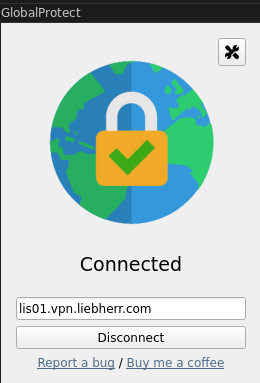

# i3 - VPN Client

VPN provides secure network communication channel. Here the Liebherr LDC VPN setup is used as proof of concept.

LDC uses openconnect client but needs also SAML Authentication which is provided by GUI based client in our case GlobalProtect which uses openconnect underneath.

| Date | Version | Description |
|------|---------|-------------|
| 08.03.2024 | v8.20-1<br>(CLI usage only) | The gpclient requires a license now<br>Therefor documented usage of cli client<br>GUI client does not work without license! |
| before 08.03.2024 | < v8.20-1<br>GUI client usage | Initial installation using GUI |

# Installation

```javascript
$ sudo add-apt-repository ppa:yuezk/globalprotect-openconnect
$ sudo apt update
$ sudo apt install globalprotect-openconnect
```

The cli is openconnect as the VPN backend, and the GUI is called gpclient.


:::warning
Since 03.2024, the GUI client requires a license!

:::

```none
$ dpkg -l | grep -i  globalprotect-openconnect
ii  globalprotect-openconnect      2.0.0+1-ppa1~ubuntu22.04     amd64      A GUI for GlobalP

$ openconnect --version
OpenConnect version v8.20-1
Using GnuTLS 3.7.3. Features present: TPMv2, PKCS#11, RSA software token, HOTP software token, \
  TOTP software token, Yubikey OATH, System keys, DTLS, ESP
Supported protocols: anyconnect (default), nc, gp, pulse, f5, fortinet, array
Default vpnc-script (override with --script): /usr/share/vpnc-scripts/vpnc-script
```

The VPN connection needs to use certificates in our case:

* <https://drive.google.com/drive/folders/1-ISiX4KENVykk0EtUCpXmUGdfbvXgnJ6?usp=sharing>
  * LiebherrEnterpriseCA02.crt
  * LiebherrRootCA2.crt

Both need to be installed at private authority store at all relevant browsers and local OS storage. Firefox and Chrome have import function integrated. The debian cert storage is at /usr/local/share/ca-certificates:

* copy certificates into storage and install by update-ca-certificates command

```javascript
$ sudo apt install -y ca-certificates
$ sudo cp LiebherrEnterpriseCA02.crt \
  /usr/local/share/ca-certificates
$ sudo cp LiebherrRootCA2.crt \
  /usr/local/share/ca-certificates
$ sudo update-ca-certificates
```

# Usage

## UI - Deprecated

Deprecated: Simply start **gpclient** as the GUI VPN client and connect to server endpoint:

* lis01.vpn.liebherr.com

 


:::warning
It is important to store certificates at all browsers as vpn client picks up certificates at webkit backend and UI at actual browser. It is not 100% clear but there were problems when certificates were not imported to all browsers firefox and chrome!

:::

On our machine there was even qutebrowser installed and VPN client authentication dialog seemed to pick qutebrowser as embedded browser. As of qutebrowser docs, it picks google chromes storage automatically…

At the end, a reboot of the machine helped which shows there might have been some cache or anything else involved in process certificate properly.

As VPN client is an application quickly needed to switch vpn on/off, it makes sense to spend a scratch-pad window for it (e.g. $mod+v):

* [i3 - Cheat Sheet](/doc/i3-cheat-sheet-6rjZsvxz6s)

x system details:

```javascript
$ xprop
WM_NAME(STRING) = "GlobalProtect"
_NET_WM_NAME(UTF8_STRING) = "GlobalProtect"
...
WM_CLIENT_MACHINE(STRING) = "ldcnb9998222"
...
WM_CLASS(STRING) = "gpclient", "gpclient"
```

## CLI

As GUI is not working anymore use cli client:

* the command follows authentication with michael.weitner@liebherr.com as user

```none
$ sudo gpclient connect lis01.vpn.liebherr.com
...
```

Further 2 authentication windows pop up until cli client is connected properly

# Troubleshooting

Sometimes the docker network conflicts with vpn client connection. Therefor, make sure docker is ok:

* …

## HIP

It looks like `gpclient` is a specific wrapper for GlobalProtect that doesn't use the `--protocol` flag because it is already hardcoded for the GlobalProtect (GP) protocol.

The most critical part of your previous logs was the **HIP Report warning**. Many Liebherr gateways will drop your connection or block internal routes (like GitHub) if that report isn't sent.

Based on the usage guide provided in your error message, here is the correct way to connect while addressing the security requirements:

### 1. The Correct Connection Command

Since you are using `gpclient`, you should use the `--hip` flag to tell the client to handle the Host Information Profile.

```javascript
sudo gpclient connect lis01.vpn.liebherr.com --hip
```

### 2. Handling the "Invalid Username/Password" (Status 512)

If you still get the `Status 512` error:

* **SSO/SAML:** Liebherr often uses SAML (Single Sign-On). If the browser window doesn't pop up or the token is expired, `gpclient` might fail with a generic "Auth failure."
* **Clean Start:** Use the `--clean` flag to clear any old, corrupted cookies or sessions:

  ```javascript
  sudo gpclient connect lis01.vpn.liebherr.com --hip --clean
  ```