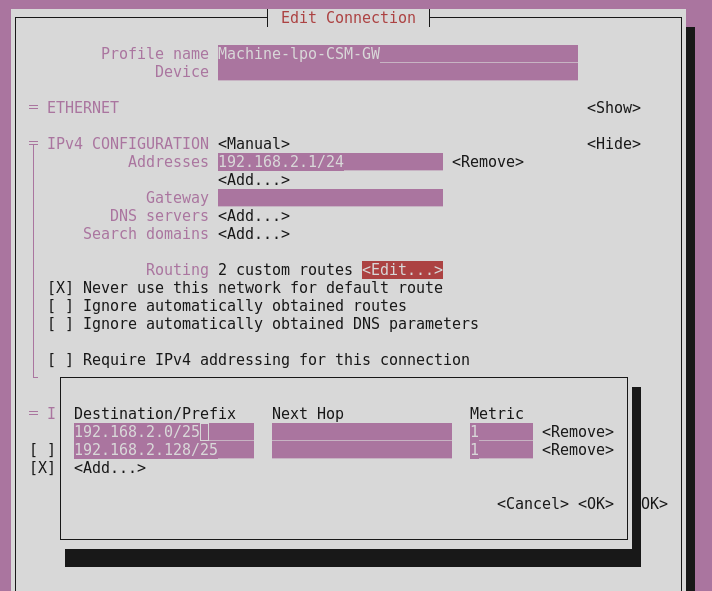
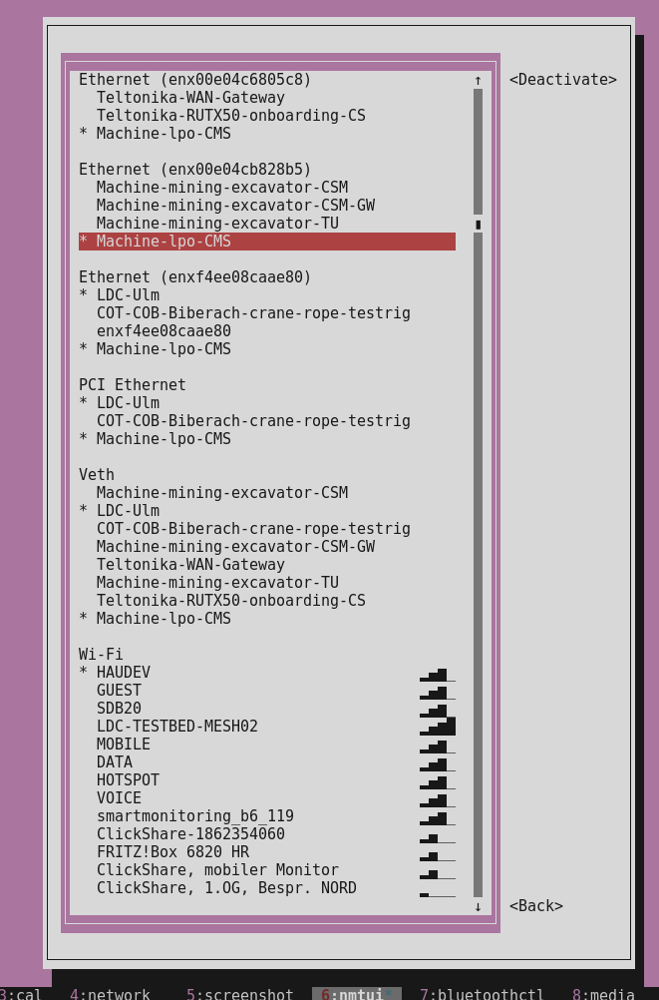

# lpo-dc5-dev - Machine Network

The LPO machine network is provided through ethernet switch, where most of the machine components are interconnected.

As of the linux-lpo repo docs, the default ip of the dc5 is **192.168.2.130/24**.

* dc5: 192.168.2.130/24
* litu3: 192.168.2.1/24
  * dhcp: enabled
* customer service/maintenance access: 192.168.2.?/24


:::info
The litu3 as the modem router has DHCP enabled and provides ip addresses within machine network.

:::


:::warning
There is also a laptop specific machine network setup documentation at:

* [ldh-ldc - Dev Network](/doc/f01e63da-eaaf-4cfe-93bd-db10ead43b77)

However, this was introduced with the mining-excavator use case for field tests. It is also relevant but we want to define a robust setup with this LPO solution and define or move it than to a general machine network setup docs somewhere at embedded software engineering…

:::

# Manual Setup (Deprecated)

The old manual setup was using ip command as not persistent solution


:::warning
This is not a perfect solution as it is not persitent throughout dev-pc reboots.

In addition, it does not use the network manager functions providing stable connection by dynamically reconnects etc..

:::

* USB2Ethernet adapter: enx00e04cb828b5

## Gateway Setup (dev-pc)

Gateway setup, where dev-pc acts as gateway:

```json
~$ sudo ip addr add 192.168.2.1/24 dev enx00e04cb828b5
~$ sudo ip link set dev enx00e04cb828b5 up
~$ sudo ip route add 192.168.3.0/24 via 192.168.3.1 dev enx00e04cb828b5
```


:::warning
If we use LiTU3 as the modem router, the LiTU3 is the gateway and we can not setup dev-pc as gateway.

:::

# Persistent Setup

A more advanced solution is to use the dev-pc's NetworkManager for more robust managed network connection. It shall not connect automatically. Instead I want to activate a profile for any link manually. For example,

* USB2Ethernet adapter: enx00e04cb828b5

or any other USB2Ethernet adapter enx…

On Fedora, USB2Ethernet adapters can also be named `enp...` (for example `enp0s20f0u2u3`) instead of `enx...`.
To avoid interface-name issues, create profiles bound to adapter MAC addresses.

## Setup Profiles By Script

From the dotfiles repository:

```bash
cd ~/dotfiles
./shell/setup-machine-network-profiles.sh --usb-mac 00:E0:4C:B8:28:B5
```

This creates/updates all `Machine-*` profiles, including the LPO profiles:

* `Machine-lpo-CSM`
* `Machine-lpo-CSM-GW`
* `Machine-lpo-dc5`

and keeps them on `connection.autoconnect no` for manual activation.

## Use Case 1: CSM Setup

 dev-pc is the **c**ustomer **s**ervice/**m**aintenance access point:

* profile name: Machine-lpo-CSM

This profile sets your PC to the standard maintenance IP. We will use a **low metric (1)** to ensure this route beats the VPN's broad rules.

Created by `./shell/setup-machine-network-profiles.sh`.

## Use Case 2: Modem Router / Gateway (CSM-GW)

In this scenario, you are replacing or simulating the `litu3` router. You need the `.1` address so that other devices (like the battery trailer components) see you as their gateway.

Created by `./shell/setup-machine-network-profiles.sh`.

## Use Case 3: DC5 Display Simulation

This is used if you need to "impersonate" the display unit, perhaps to test how other controllers react when the display is offline.

Created by `./shell/setup-machine-network-profiles.sh`.

## Scenario Overview

| **==Profile Name==** | **==Assigned IP==** | **==Use Case==** |
|--------------|-------------|----------|
| **==Machine-lpo-CSM==** | `192.168.2.200` | ==Standard diagnostic access.== |
| **==Machine-lpo-CSM-GW==** | `192.168.2.1` | ==Acting as the system router/internet provider.== |
| **==Machine-lpo-dc5==** | `192.168.2.130` | ==Impersonating the trailer display.== |

## How to use profiles?

You can now quickly swap between these identities using the terminal:

```javascript
# To switch to CMS mode:
nmcli connection up "Machine-lpo-CSM"

# To check which one is currently active:
nmcli connection show --active | grep Machine
```

## Dealing with VPN

the classic VPN "route hijacking." Your `route -n` output shows exactly what is happening: your VPN client (GlobalProtect/gpclient) is fighting you for control of the `192.168.2.0` subnet.

### 🔍 The Conflict

Look at these two lines in your routing table:


1. `192.168.2.0 0.0.0.0 255.255.255.0 U 0 tun0`
2. `192.168.2.0 0.0.0.0 255.255.255.0 U 1 enx00e04c6805c8`

The VPN has created a route for `192.168.2.0` on the **tun0** interface with a metric of **0**. Because a lower metric wins, your computer is trying to send all "Machine Network" traffic into the VPN tunnel instead of out through your USB adapter.


:::info
See following VPN Fix options, where we go for "Option 1: Specific Route Hack"

:::

## VPN Fix

### 🛠️ The Fix: Reclaim your Subnet

You need to tell the Linux kernel that the physical adapter has priority over the VPN tunnel for this specific range. You can do this by deleting the VPN's route or adding a more specific route.

### Option 1: "Specific Route Hack" (Most Reliable)

Instead of fighting the VPN's `/24` route, we create two smaller `/25` routes. In networking, the **longest prefix (most specific mask) always wins**, regardless of the metric.

Run this on your Dev-PC:

```javascript
# Split the 192.168.2.0/24 into two /25 halves
sudo ip route add 192.168.2.0/25 dev enx00e04c6805c8
sudo ip route add 192.168.2.128/25 dev enx00e04c6805c8
```

This forces all `192.168.2.x` traffic to the USB adapter because a `/25` mask is "more specific" than the VPN's `/24`.

Instead of the none persistent manual step, add the routes to the nmtui profiles:

 

### Option 2: Delete the VPN Route

If your corporate network doesn't actually have anything important on `192.168.2.x`, you can just kill the VPN's claim to it:

```javascript
sudo route del -net 192.168.2.0 netmask 255.255.255.0 dev tun0
```

*Note: GlobalProtect is aggressive and might re-add this route automatically after a few minutes.*

### Option 2-1: The "Override" Step

Since your VPN keeps trying to steal the `192.168.2.0/24` range (just like it did with the `.3.0` range), you should add the specific "Host Route" for the device you are trying to reach (e.g., a battery controller at `.10`) after you activate the profile:

```javascript
# Example: If you need to reach a specific controller at 192.168.2.10
sudo ip route replace 192.168.2.10/32 dev enx00e04cb828b5 metric 0
```

### Preventing the "Connection Refused" (VPN Security)

Many corporate VPNs have a "No Split Tunneling" policy. When the VPN is active, it may drop packets that aren't intended for the tunnel.

If you fix the routes but the DC5 still can't get to the internet, you likely need to add a specific **iptables rule** to exempt your machine network from being "swallowed" by the VPN's filtering:

```javascript
# Force-allow forwarding for the machine network even if VPN is up
sudo iptables -I FORWARD 1 -i enx00e04c6805c8 -j ACCEPT
sudo iptables -I FORWARD 2 -o enx00e04c6805c8 -j ACCEPT
```


:::info
It is not needed with our VPN

:::

## Auto Setup

To make this seamless, we'll create a script called `lpo-switch.sh`. This script handles the NetworkManager profile switching and then "punches a hole" through your VPN by applying high-priority host routes for the entire `.2.x` range.

### 1. Create the Switcher Script

Since the profiles are no longer tied to a specific hardware name, we need to tell the script to **detect** which USB adapter is currently plugged in and apply the profile to it.

Update your `~/lpo-switch.sh`:

```bash
#!/bin/bash

# Detect the USB2Ethernet interface automatically
# This looks for names starting with 'enx' (common for USB adapters)
IFACE=$(ip -o link show | awk -F': ' '{print $2}' | grep '^enx' | head -n 1)

if [ -z "$IFACE" ]; then
    echo "Error: No USB Ethernet adapter (enx...) detected!"
    exit 1
fi

show_usage() {
    echo "Target Interface: $IFACE"
    echo "Usage: ./lpo-switch.sh [cms | gw | dc5 | off]"
}

case "$1" in
    cms) PROFILE="Machine-lpo-CSM" ;;
    gw)  PROFILE="Machine-lpo-CSM-GW" ;;
    dc5) PROFILE="Machine-lpo-dc5" ;;
    off) 
        nmcli device disconnect "$IFACE"
        echo "Interface $IFACE disconnected."
        exit 0 ;;
    *) show_usage; exit 1 ;;
esac

echo "Activating $PROFILE on $IFACE..."

# Force the profile onto the detected interface
nmcli device connect "$IFACE" 2>/dev/null
nmcli connection up id "$PROFILE" ifname "$IFACE"

# Apply the VPN route override (the 'hammer')
echo "Applying VPN-override for 192.168.2.0/24..."
sudo ip route replace 192.168.2.0/24 dev "$IFACE" proto static metric 0

echo "Done. Current IP: $(ip -4 addr show $IFACE | grep -oP '(?<=inet\s)\d+(\.\d+){3}')"
```

### 2. Make it Executable

```bash
chmod +x ~/lpo-switch.sh
```

### 3. How this workflow looks now


1. **Plug in any USB Ethernet adapter.**
2. **Run the script:** `./lpo-switch.sh cms`.
3. **The script finds the adapter** (e.g., `enx00e...` or a new one like `enx66a...`).
4. **NetworkManager applies the profile** to that specific hardware only for this session.
5. **VPN routes are overridden** automatically.

### Clean-up Hint

If you have old versions of these profiles that keep auto-connecting, you can remove all of them first before running the new commands: `nmcli connection show | grep Machine-lpo | awk '{print $1}' | xargs -I{} nmcli connection delete id "{}"`


---

### Why this is "VPN-Proof"

By using `ip route replace ... metric 0` in the script, you are manually overwriting whatever the VPN client just tried to do. Even if the VPN adds a route for the same range, your script (running second) ensures your local USB adapter is the preferred path.

### Important Tip for `gw` (Gateway) mode:

In **Gateway mode**, the components in the trailer (like the battery controllers) will try to send their internet traffic to **192.168.2.1**. For this to actually work, make sure your NAT rules from the previous step are still active on the `dev-pc`:

```javascript
# Run this once to ensure NAT is active for the .2.x range
sudo iptables -t nat -A POSTROUTING -o enxf4ee08caae80 -j MASQUERADE
```

# Configure NAT (Masquerading) via IPTables

```bash
# Replace with your actual interface names from 'ip a'
INT_IF="enx00e04cb828b5"      # USB Adapter (Machine side)
EXT_IF="enxf4ee08caae80"      # Docking Station (Internet side)

# Flush any old rules (Careful if you have other custom firewall rules!)
sudo iptables -t nat -F
sudo iptables -F

# Allow NAT (Masquerading) on the internet-facing interface
sudo iptables -t nat -A POSTROUTING -o $EXT_IF -j MASQUERADE

# Allow traffic to flow between the interfaces
sudo iptables -A FORWARD -i $INT_IF -o $EXT_IF -j ACCEPT
sudo iptables -A FORWARD -i $EXT_IF -o $INT_IF -m state --state RELATED,ESTABLISHED -j ACCEPT
```

raw commands:

```bash
# Flush any old rules (Careful if you have other custom firewall rules!)
sudo iptables -t nat -F
sudo iptables -F

# Allow NAT (Masquerading) on the internet-facing interface
sudo iptables -t nat -A POSTROUTING -o enxf4ee08caae80 -j MASQUERADE

# Allow traffic to flow between the interfaces
sudo iptables -A FORWARD -i enx00e04cb828b5 -o enxf4ee08caae80 -j ACCEPT
sudo iptables -A FORWARD -i enxf4ee08caae80 -o enx00e04cb828b5 \
  -m state --state RELATED,ESTABLISHED -j ACCEPT
```

# DNS Server

The local dnsmasq server helps to support such machine network setups. Therefor, we setup a specific dnsmasq config. For example dc5 display dc5dev4:

* mac: 00:11:b8:20:46:c4

Light weight config:

* cat /etc/dnsmasq.conf

```ini
# Basic DNS functionality
port=53
domain-needed
bogus-priv

# Interface Binding
# Use the Dev-PC USB adapter and localhost
interface=enx00e04cb828b5
listen-address=127.0.0.1
listen-address=192.168.2.1
bind-dynamic

# DHCP Range for machine network
dhcp-range=192.168.2.10,192.168.2.100,12h

# Static IP for your current DC5DEV4 device
dhcp-host=00:11:b8:20:46:c4,192.168.2.130,infinite

# Push Gateway, DNS, and NTP to the display
dhcp-option=option:router,192.168.2.1
dhcp-option=option:dns-server,192.168.2.1
dhcp-option=option:ntp-server,192.168.2.1

# IoT / FOTA Redirection (Liebherr specific)
address=/lpo-dc5-v1.fota.iotdevices.liebherr.com/10.242.162.5

# Logging for easier troubleshooting
log-facility=/var/log/dnsmasq.log
log-dhcp
log-queries
```

# NTP Server

The dev-pc acts also as ntp server.

By default, chrony only listens to the local machine. You must tell it to allow requests from your USB adapter's subnet.

* Edit `/etc/chrony/chrony.conf`:

  ```javascript
  # Allow the DC5 display subnet
  allow 192.168.2.0/24
  # Ensure the PC is considered a valid source even if offline
  local stratum 10
  ```

# Routing & Firewall "Master Script"

Run this to ensure the kernel forwards traffic and bypasses any TCP blocks:

```ini
#!/bin/bash
# Enable IP Forwarding
sudo sysctl -w net.ipv4.ip_forward=1
sudo sysctl -w net.ipv4.conf.all.rp_filter=0

# Clear and Set Forwarding Rules
sudo iptables -P FORWARD ACCEPT
sudo iptables -F FORWARD
sudo iptables -t nat -F
sudo iptables -t nat -A POSTROUTING -o enxf4ee08caae80 -j MASQUERADE

# Fix "Connection Refused" via MSS Clamping
sudo iptables -t mangle -F
sudo iptables -t mangle -A FORWARD -p tcp --tcp-flags SYN,RST SYN -j TCPMSS --clamp-mss-to-pmtu

# Flush ARP to prevent MAC/IP conflicts
sudo ip neighbor flush dev enx00e04cb828b5
```

## Next evolution

```bash
#!/bin/bash
# 1. Interface Definitions
USB_IF="enx00e04cb828b5"
VPN_IF="tun0"

echo "Step 1: Forcing Forwarding & Disabling VPN 'Kill-Switch' Logic..."
sudo sysctl -w net.ipv4.ip_forward=1
# Disable Reverse Path Filtering (Crucial: prevents dropping 'asymmetric' VPN traffic)
sudo sysctl -w net.ipv4.conf.all.rp_filter=0
sudo sysctl -w net.ipv4.conf.$USB_IF.rp_filter=0
sudo sysctl -w net.ipv4.conf.$VPN_IF.rp_filter=0

echo "Step 2: Cleaning and Prioritizing Forwarding Rules..."
# Force absolute priority for your machine network
sudo iptables -P FORWARD ACCEPT
sudo iptables -F FORWARD
sudo iptables -I FORWARD 1 -i $USB_IF -j ACCEPT
sudo iptables -I FORWARD 2 -o $USB_IF -j ACCEPT

echo "Step 3: Setting NAT Masquerade for the VPN Tunnel..."
sudo iptables -t nat -F
# This rule hides the DC5 (192.168.2.130) behind your VPN IP (172.28.216.91)
sudo iptables -t nat -A POSTROUTING -o $VPN_IF -j MASQUERADE

echo "Step 4: Applying TCP MSS Clamping (Fixes MTU issues over VPN)..."
# VPNs have smaller MTU; without this, HTTPS handshakes fail
sudo iptables -t mangle -F
sudo iptables -t mangle -A FORWARD -p tcp --tcp-flags SYN,RST SYN -j TCPMSS --clamp-mss-to-pmtu

echo "Step 5: Refreshing local network environment..."
sudo ip neighbor flush dev $USB_IF
sudo systemctl restart dnsmasq

echo "DONE. Try 'wget https://www.google.de' on the DC5 now."
```

real script:

```bash
```

# DC5 Display Configuration

Make sure the dc5 display points to dev-pc for all services:

```ini
root@imx6q-display5:/tmp# cat /lib/systemd/network/10-wired.network
[Match]
...
[Network]
Address=192.168.2.130/24
Gateway=192.168.2.1
DNS=192.168.2.1
NTP=192.168.2.1
...
```

# Verify Connection

## Activate CSM Profile

Using nmtui:


 

## Verify Internet & DNS