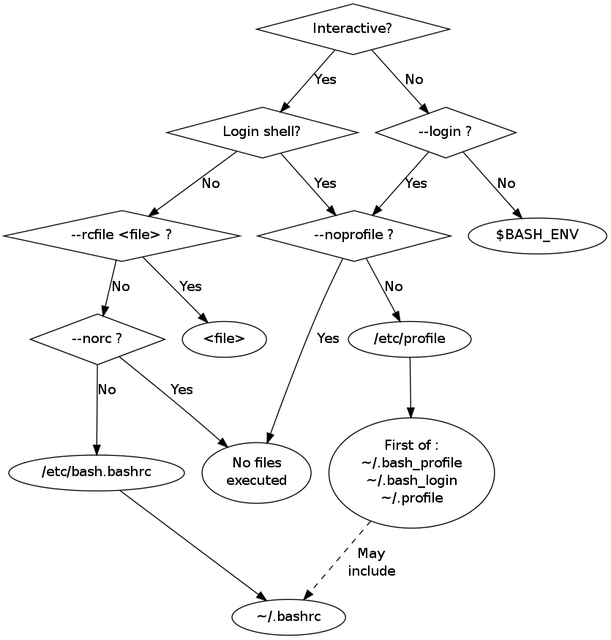

# Shell - bash

# Configuration

There is a nice blog explaining bash shell configuration:

* <https://linuxhint.com/understanding_bash_shell_configuration_startup/>

It is important to understand the configuration flow in this graph. For example it tells us that it's fine to use environment variables like `XDG_CONFIG_HOME` in `.bashrc` as its sourced at the end of the process where all environment variables should be exported.

 