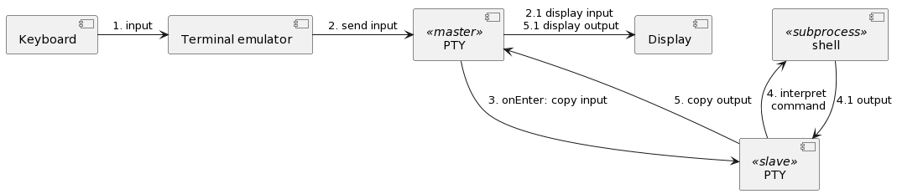

# ldh-shell - Terminal Emulator

A terminal emulator provides functionality of historically Video Terminal and TTY (**T**ele **Ty**pe) which where physical machines to type commands and transfer it over long distance. In case of Tele Type machines long before computers existed.

Terminal emulator is a software representation of TTY and Video Terminal machine.

TTY is an emulated terminal with TTY drivers - implemented in the kernel - allowing to run multiple programs in parallel. Input is send to TTY by input device like keyboard and mouse with a program on the foreground. This program is the shell. Its possible to run many applications in the background but you can only interact with one program in the foreground the shell prompt.

In our base ArchLinux system the terminal we are login is directly emulated by the kernel. When we use our window manager GUI e.g. i3 we will use URxvt instead, a graphical terminal emulator which can be run directly by user. That's why such terminal is called a Pseudo Terminal device, or PTY. When starting URxvt, a PTY master and a PTY slave (called PTS) will be created and the current user shell will run as a subprocess (childprocess) of the PTY slave (PTS).

 

[https://drive.google.com/file/d/1tHYR-Znz5XR21Z%5FZnLm4SqBcXLegPdlY/view?usp=sharing](https://drive.google.com/file/d/1tHYR-Znz5XR21Z%5FZnLm4SqBcXLegPdlY/view?usp=sharing)

The terminal emulator like `urxvt` processes keyboard input:

* 1., 2., 2.1: keyboard input is copied by terminal emulator to PTY master which sends it to Display
* 3.: enter input: PTY master copies entire input as command to PTY slave (PTS)
* 4.: shell interprets command
* 4.1, 5., 5.1: if needed shell sends some output back which is copied to PTY master which sends it to Display