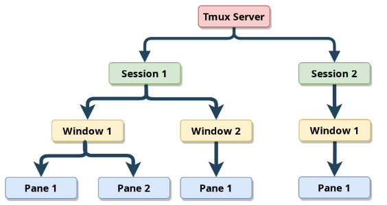

# ldh-shell - Tmux

Terminal Multiplexer which provides terminal session management attached to a Terminal Emulator like our UXrvt.

Why tmux?

* use multiple terminals on a single screen
* close terminal(s) but let the session run in background to be able to reattach to closed terminal session(s)
* persist terminal session(s) to be reopened even after reboot of computer
* remote pair programming by tmux server client architecture through ssh connection

Following applies for ArchLinux as prototype as well as:

* Ubuntu
* Fedora (todo)

# Install

```javascript
~ > sudo pacman -S tmux
~ > tmux -V                                                                                                   λ:main  [   ]
tmux 3.2a
```

ubuntu:

```javascript
$ sudo apt install -y tmux
```

# Concept

 

# Configuration

tmux config is installed by dotfiles repo `$DOTFILES/tmux/tmux.conf` symlinked to `$XDG_CONFIG_HOME/tmux/tmux.conf`.

## Vim Integration

The mouseless development book shows a way to seamlessly integrate vim into tmux using same pane navigation ect.. Personally I do not really like this. I am happy with difference in navigation, it shows me in which context I am working:

* As soon as I end up at **tmux vim** window, I am using SpaceVim's navigation model with vim window and vim buffers
* If I want to navigate out of **tmux vim** window, I am using tmux navigation model `Ctrl-[hjkl]`
* In general with tmux windows, I am using the tmux navigation model `Ctrl-[hjkl]`

That works nicely independent of which vim editor I am using.

As I am using SpaceVim with gvim or neovim, it would be possible to integrate it closer with tmux by SpaceVim layer:

* <https://spacevim.org/layers/tmux/>

I do not need this!!!

## URxvt Integration

Where vim is the tightest integration as an application running within a tmux window, urxvt as terminal emulator is the next more loose integration as it provides the actual terminal where new windows are created. It can be seen as the client container, where the tmux server session and a tmux window is connected to.

URxvt itself provides multi window structured as tabs, where each window or tab is an terminal instance. If a new urxvt tab is opened within a tmux window it does not belong to that tmux session.

That shows it's not integrated at all. Instead we could create a urxvt tab and create a new tmux session at it.

## i3 Integration

i3 itself supports multi terminal windows and navigation around them. Here I do not want to have a very tight integration. Its ok if the navigation model differs, as similar to vim integration, I know in which context I am.

Here it is even easier as i3 is separate from tmux.

# Design

is also configured at tmux.conf shared by dotfiles repo.

# Plugins

plugins are configured as usual at tmux.conf, where plugin installation is automated by dotfiles repo.

Current plugins are:

* tmux-plugins/tmux-copycat: advanced search without need of copy mode
* laktak/extrakto: fuzzy search by fzf and copy

# Session Management

Advanced session management is done by using tmuxp:

* session config(s) are installed by dotfiles repo and symlinked to `$XDG_CONFIG_HOME/tmuxp/*.yml`

```javascript
> sudo pacman -S tmuxp
```

ubuntu:

```javascript
$ sudo apt install tmuxp
```

Alternatives/Additions to tmuxp are:

* <https://github.com/tmuxinator/tmuxinator>
* …

## Create resusable tmux session

Nice blog about managing tmux sessions:

* <https://betterprogramming.pub/how-to-use-tmuxp-to-manage-your-tmux-session-614b6d42d6b6>

Create tmux session config for`term-ws1`at dotfiles repo:

```javascript
$ vim ~/dotfiles/tmuxp/term-ws1.yaml
session_name: term-ws1
windows:
  - window_name: term-ws1 
    panes:
      - blank
:wq
```

Load tmux session at i3 workspace 1 terminal:

* start urxvt terminal instance with explicit name
* move that terminal instance to workspace 1:
  * `$mod+Ctrl+1`
* load template tmux session `starter` in that terminal instance

```javascript
$ tmuxp load starter
```

Verify with xprop tool that terminal instance has got explicit name:

* WM_CLASS should show instance=term-ws1 and class=URxvt

```javascript
 $ xprop
...
_NET_STARTUP_ID(UTF8_STRING) = "i3/urxvtc/2002-4-snake_TIME405527"
...
WM_LOCALE_NAME(STRING) = "en_US.UTF-8"
WM_CLASS(STRING) = "term-ws1", "URxvt"
...
WM_CLIENT_MACHINE(STRING) = "snake"
WM_COMMAND(STRING) = { "urxvt", "-cd", "/home/michael", "-name", "term-ws1" }
_NET_WM_ICON_NAME(UTF8_STRING) = "term-ws1"
WM_ICON_NAME(STRING) = "term-ws1"
_NET_WM_NAME(UTF8_STRING) = "term-ws1"
WM_NAME(STRING) = "term-ws1"
```

Adapt tmux session layout until happy and then save it:

* in this case `term-ws1.yaml`

```javascript
 $ tmuxp freeze starter
Convert to [yaml]: 
---------------------------------------------------------------
Freeze does its best to snapshot live tmux sessions.

The new config *WILL* require adjusting afterwards. Save config? [y/N]: y
Save to: /home/michael/.config/tmuxp/starter.yaml [/home/michael/.config/tmuxp/starter.yaml]: /home/michael/.config/tmuxp/term-ws1.yaml
Save to /home/michael/.config/tmuxp/term-ws1.yaml? [y/N]: y
Saved to /home/michael/.config/tmuxp/term-ws1.yaml.
```

Adapt stored yaml to your needs:

* kill tmux session by `Ctrl+d` or `tmux kill-session`
* changed session_name to `term-ws1`
* changed shell_command of window\[w1\] to none

```bash
$ cat ~/dotfiles/tmuxp/term-ws1.yaml
session_name: term-ws1
windows:
- focus: 'true'
  layout: b1de,273x60,0,0,1
  options:
    automatic-rename: 'off'
  panes:
  - focus: 'true'
    shell_command:
  start_directory: /home/michael
  window_name: w1
```

Load tmux session to verify:

```javascript
$ tmuxp load term-ws1
```

That's it nice method to start from tmux template and store reusable instance of tmux session.

## Scripting Functions

the tmux infrastructure provides some API which is accessable by

* <https://libtmux.git-pull.com/api.html>
* <https://github.com/tmux-python/libtmux>
* …

By the way tmuxp is a python based session manager accessing the API through libtmux python library.

One of my own Examples is following:

* I wanted to have a quick way to open new development window within existing tmux session

Solution:

Simple bash script function which is sourced by my shell e.g. zsh. Details can be found at dotfiles repo `./zsh/scripts.sh` :

* the function tmux-new-window takes session name and working directory as input and creates new window with two panes where top pane has vim open and bottom pane just terminal both at working directory

```javascript
...
tmux-new-window() {
  #
  # param[1] session - name
  # param[2] wd - working directory (full path)
  # param[3, optional] window - name (default: wd last path name)
  #
  if [[ -z "$TMUX" ]]; then
    return
  fi

  session=$1
  wd=$2
  window=$3
  if [[ -z "$window" ]]; then
    window=$(basename $wd)
  fi

  last_window_name=$(tmux list-windows -t $session -F \#w | tail -n1)
  if [[ -z "$last_window_name" ]]; then
    echo "no window must not be possible as there is always window:0"
  fi

  echo "create new window: session: $session:$window, wd: $wd"
  tmux new-window -t $session -n $window
  tmux send-keys -t $session:$window "cd $wd" Enter
  tmux send-keys -t $session:$window "vim" Enter
  tmux split-window -v -t $session:$window -p 30
  #pane index starts with 1
  tmux send-keys -t $session:$window.2 "cd $wd" Enter C-g
  tmux select-pane -t $session:$window.1
}
```

Usage as is follows:

* current session is term-dev

```javascript
$ tmux-new-window term-dev /home/michael/dev/linux_rpi/linux
```

# Pair Programming

Tmux supports pair programming by sharing tmux session…

* <https://www.hamvocke.com/blog/remote-pair-programming-with-tmux/>
* <https://dev.to/casonadams/pair-programing-with-vi-and-tmux-2h47>
* <https://medium.com/@gaelollivier/connect-to-your-raspberry-pi-from-anywhere-using-ngrok-801e9fd1dd46>


\

\