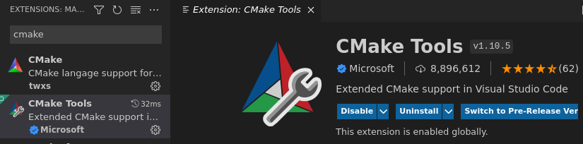
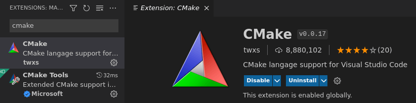

# vscode - CMake Project

vscode has got excellent cmake support by it's extensions.

# Install CMake Extensions

The extensions to be installed is `CMake Tools` which installs another extension `CMake twsx` automatically.

 

 

# Create CMake Project from Scratch

see [CMake](/doc/cmake-YBsUGhQwj9).

\