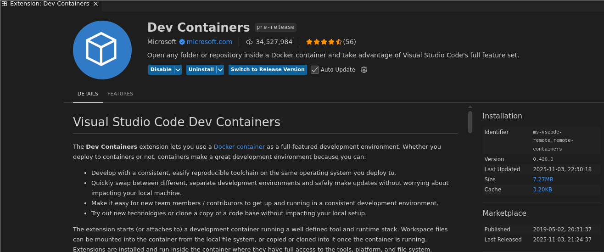
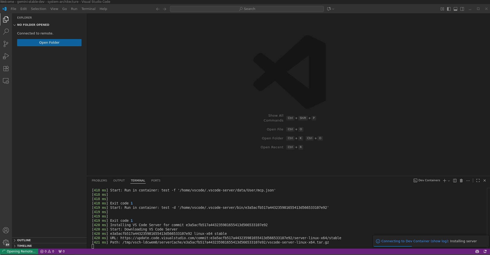
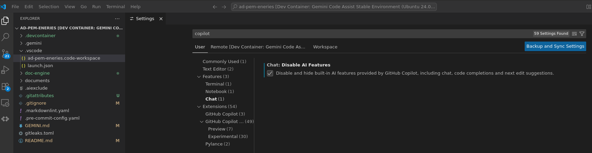
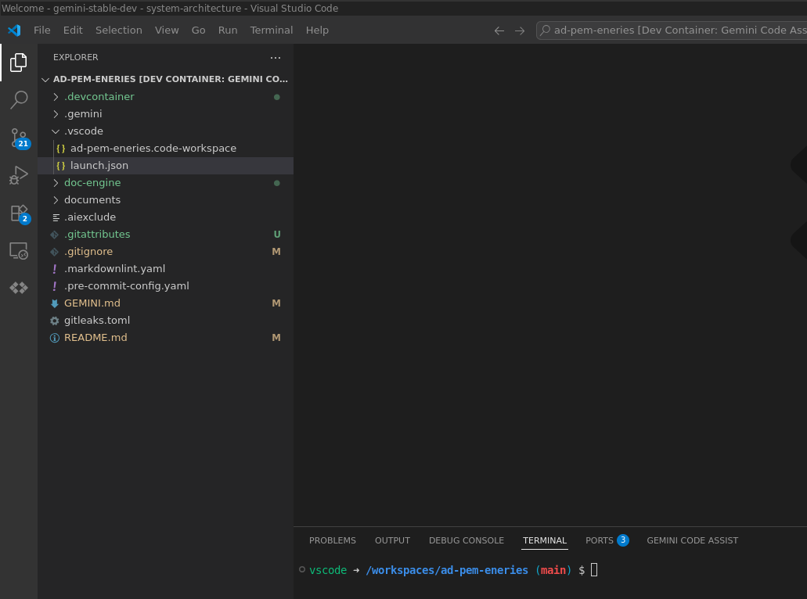
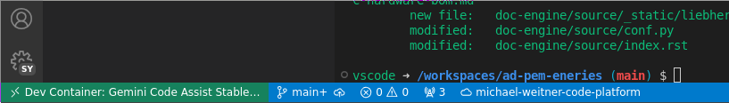
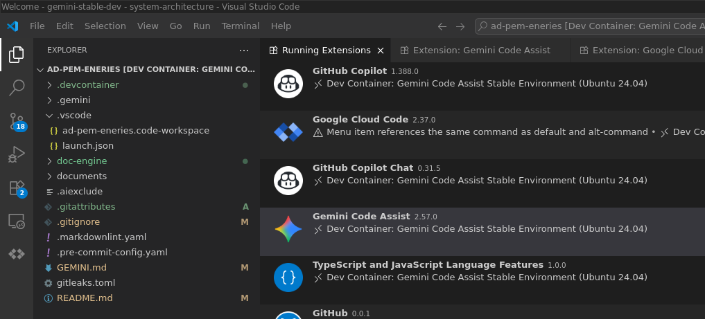
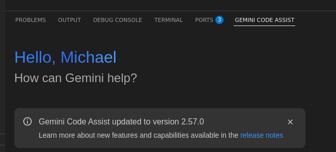

# vscode - Dev Containers

> Since your goal is to use the **VS Code Dev Containers** extension to solve the **GLIBC incompatibility** and ensure a stable environment for Gemini, we will focus on setting up the necessary files and then using the VS Code CLI commands to attach to it.

The Dev Containers extension was already installed.

 

# Prepare

```python
~$ docker --version
Docker version 28.4.0, build d8eb465

~$ code --version
1.104.2
e3a5acfb517a443235981655413d566533107e92
x64
```

create devcontainer project:

```python
~$ mkdir -p ~/dev-tools/gemini-stable-dev && cd ~/dev-tools/gemini-stable-dev
~/dev-tools/gemini-stable-dev$ mkdir .devcontainer
~/dev-tools/gemini-stable-dev$ touch .devcontainer/devcontainer.json
~/dev-tools/gemini-stable-dev$ cat .devcontainer/devcontainer.json
{
    "name": "Gemini Code Assist Stable Environment (Ubuntu 24.04)",

    // Use a modern base image that guarantees GLIBC 2.38+
    "image": "mcr.microsoft.com/devcontainers/base:ubuntu-24.04",

    // Run post-create commands to install necessary OS tools
    "postCreateCommand": "apt-get update && apt-get install -y git wget curl",

    // Essential VS Code Extensions to install inside the container
    "customizations": {
        "vscode": {
            "extensions": [
                "Google.geminicodeassist", // The target extension
                "GoogleCloudTools.cloudcode",
                "ms-python.python"
            ]
        }
    },

    // Forward the port where the Gemini Agent might run (if necessary)
    "forwardPorts": [45207],

    // Default terminal to use (optional)
    "remoteUser": "vscode"
}
```


:::info
This file tells VS Code which image to use, which extensions to install, and what settings to apply. We will use a standard, modern Ubuntu image to guarantee GLIBC 2.36+ compatibility.

:::

## Create repo

```python
~/dev-tools/gemini-stable-dev$ git init

~/dev-tools/gemini-stable-dev$ touch .gitignore
~/dev-tools/gemini-stable-dev$ touch .gitattributes
~/dev-tools/gemini-stable-dev$ git add .

~/dev-tools/gemini-stable-dev$ git status
On branch main

No commits yet

Changes to be committed:
  (use "git rm --cached <file>..." to unstage)
        new file:   .devcontainer/devcontainer.json
        new file:   .gitattributes
        new file:   .gitignore


~/dev-tools/gemini-stable-dev$ git commit -m "initial commit"
```

# Use

## Start vscode

```python
~/dev-tools/gemini-stable-dev$ code . --container-setup-and-open
Warning: 'container-setup-and-open' is not in the list of known options, but still passed to Electron/Chromium.
```

# Use the Dedicated Dev Container CLI

## Install

```python
~/dev-tools/gemini-stable-dev$ nvm use default
Now using node v23.9.0 (npm v10.9.2)

~/dev-tools/gemini-stable-dev$ node -v
v23.9.0

~/dev-tools/gemini-stable-dev$ npm install -g @devcontainers/cli

added 1 package in 981ms
npm notice
npm notice New major version of npm available! 10.9.2 -> 11.6.2
npm notice Changelog: https://github.com/npm/cli/releases/tag/v11.6.2
npm notice To update run: npm install -g npm@11.6.2
npm notice
```

## Launch stable Environment

Launching stable environment is a two step process:

* Build and Start the Container

```python
~/dev-tools/gemini-stable-dev$ devcontainer up --workspace-folder "$(pwd)"
[1 ms] @devcontainers/cli 0.80.1. Node.js v23.9.0. linux 5.15.0-160-generic x64.
...
```

* Attach VS Code to the Running Container


:::warning
The gemini suggested command does not exist with my devcontainer version 0.80.1:

```python
~/dev-tools/gemini-stable-dev$ devcontainer open --workspace-folder "$(pwd)"
devcontainer <command>

Commands:
  devcontainer up                   Create and run dev container
  devcontainer set-up               Set up an existing container as a dev container
  devcontainer build [path]         Build a dev container image
  devcontainer run-user-commands    Run user commands
  devcontainer read-configuration   Read configuration
  devcontainer outdated             Show current and available versions
  devcontainer upgrade              Upgrade lockfile
  devcontainer features             Features commands
  devcontainer templates            Templates commands
  devcontainer exec <cmd> [args..]  Execute a command on a running dev container

Options:
  --help     Show help                                                                                         [boolean]
  --version  Show version number                                                                               [boolean]

devcontainer@0.80.1 /home/ldcwem0/.config/nvm/versions/node/v24.11.0/lib/node_modules/@devcontainers/cli

Unknown arguments: workspace-folder, workspaceFolder, open
```

:::

## Shutdown Container

As the devcontainer is based on docker, some tasks are done using native docker commands.

```python
~/dev-tools/gemini-stable-dev$ docker container ls |grep gemini
5b637e127472   vsc-gemini-stable-dev-5ca061da2523a56a140a16c418fe34607d51324892c378b83281343251ec8906-uid   "/bin/sh -c 'echo Co…"   27 seconds ago   Up 26 seconds                                                           stoic_lovelace

~/dev-tools/gemini-stable-dev$ docker stop 5b637e127472
# cleanup container
~/dev-tools/gemini-stable-dev$ docker rm 5b637e127472
```

# Attach vscode

The most important part is to attach the vscode program to devcontainer. As the open command is not available, we need to start vscode and use the Dev Containers extension.

## Open vscode

Select devcontainer and attach it to this vscode session

 

## Disable copilot

 


 

## Verify

How do we know everything is setup as we want it using the devcontainer?

### Status Bar

 

### Extensions

* open command palette ctrl+shift+P → Developer: Show Running Extensions

 

## Open gemini chat


:::info
The auto update to gemini v2.57.0 is announced now, as we solved the 

:::

 